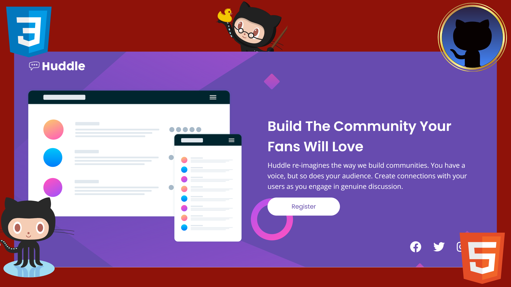

# Frontend Mentor - Huddle landing page with single introductory section

## Welcome! 👋

## Hi my name is Fabio Fernandes de Lima, I'm 41 years old,I programming student at Senac SP  

## Where to find me?🔍

**Here you can find some projects that I'm studying and developing! and my contact on linkedIn!
I'm sorry for the English from Google translator!**🤷‍♂️

- GitPage - [FabioJoey](https://fabiojoey.github.io/huddle-landing-page)
- Frontend Mentor - [@fabiojoey](https://www.frontendmentor.io/profile/fabiojoey)
- LinkedIn - [Fabio Lima](https://www.linkedin.com/in/fabio-fernandes-lima-a39105224/)

## Desafio FrontMentor stats-preview-card-component-main

Esta página foi desenvolvida com ferramentas html e css.
Desta vez o desafio era reproduzir o site quase que 100% no html, usando a folha css só quando necessário, acho que não foi um bom momento devido a minha falta de experiência! 
Talvez o código tenha ficado um pouco desorganizado!  

## Este Desafio só foi possível completar com a ajuda dos videos:

**Canal do YouTube**

# TsbSankara #

(https://www.youtube.com/watch?v=A0t0c_znZJ8)

**We meet in the next challenges...!** 🚀

